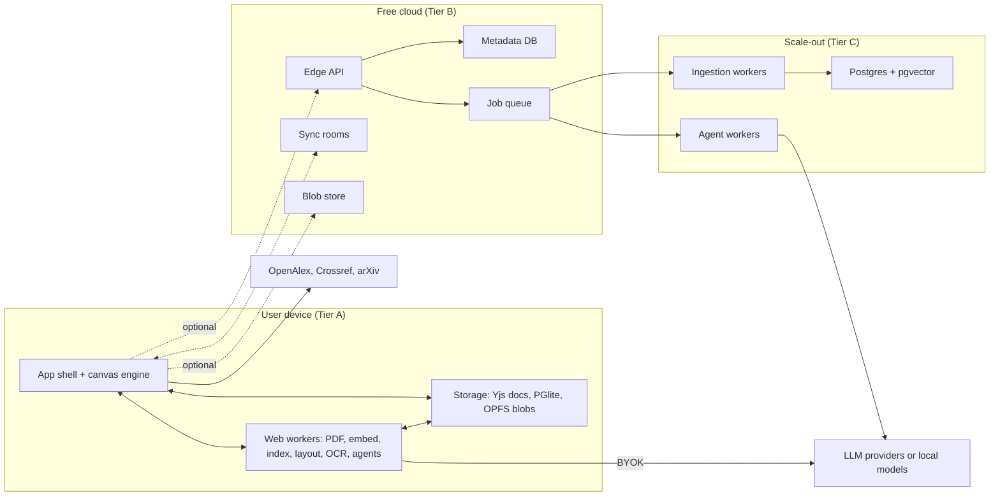
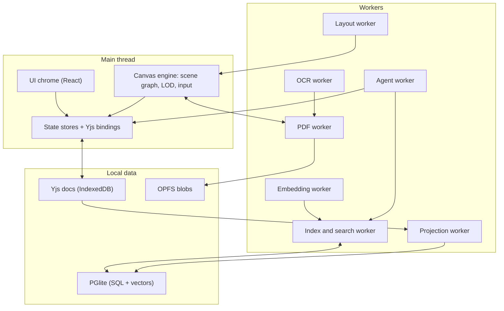
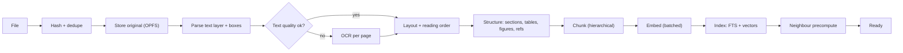
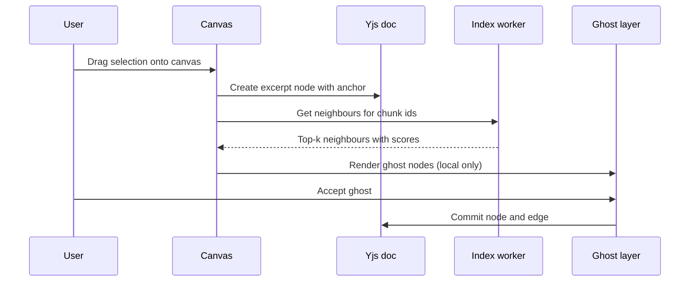
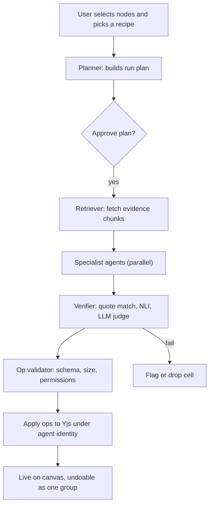
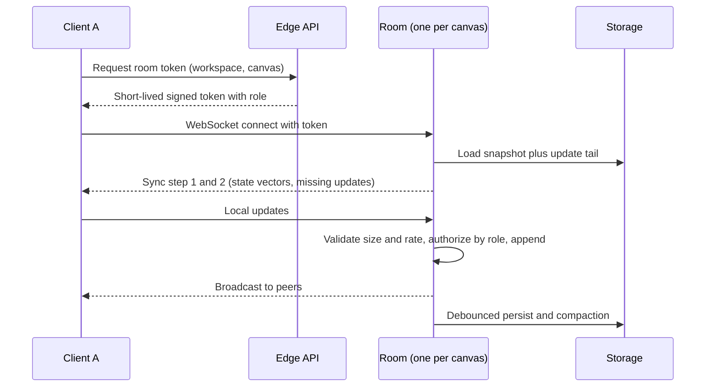
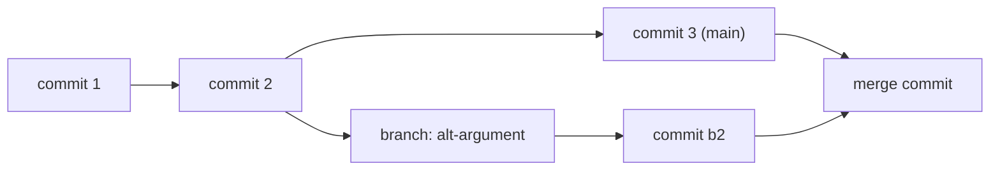

# Spatial Research Workspace: Features and System Architecture

Working title · Specification v1.0 (draft) · 19 September 2026

> **Hard constraint: zero budget.** Every decision defaults to free tiers, open-source software, and running on the user's own device. Paid infrastructure appears only as an optional, later tier.

## Contents

1. Product overview
2. Feature catalog (phased)
3. System architecture
4. Data model
5. Agent system
6. Knowledge graph
7. Collaboration, sync and versioning
8. Backend services (cloud tiers)
9. Security and privacy
10. Performance budgets and testing
11. Observability, repo, CI/CD
12. Cost model and scaling path
13. Risks and mitigations
14. Roadmap and exit criteria
15. Decision log
16. Appendices

---

## 1. Product overview

### 1.1 Vision

A web-based reading and thinking environment where documents become movable, connected ideas on an infinite canvas, and an AI research partner does the tedious work (finding related passages, extracting comparable facts, checking claims) while every output stays traceable to an exact place in a source document.

The product is not "a whiteboard with PDFs" and not "a chatbot over PDFs". It is a **spatial workspace whose contents are grounded by construction**.

### 1.2 Positioning

| Dimension | Manual spatial reading tools | This platform |
|---|---|---|
| Connecting ideas | User drags and links everything by hand | AI proposes connections in a ghost layer; user accepts or rejects |
| Cross-document work | Manual search and copy | Semantic retrieval across the whole library, instantly |
| Synthesis | User builds comparisons manually | Synthesis tables filled by agents, every cell cited and verified |
| Trust | N/A | Each generated claim links to a verbatim quote and page location |
| Delivery | Typically installed apps | Zero-install web app, works offline, documents stay on-device by default |
| Data ownership | Tool-specific formats | Open export formats (Markdown, JSON, CSL-JSON, BibTeX, annotated PDF) |

### 1.3 Design principles

1. **Local-first, cloud-optional.** The complete single-user product works with no server.
2. **AI proposes, the human disposes.** Suggestions live in an ephemeral layer until accepted. AI never moves user-placed objects.
3. **Every claim has a citation.** No generated statement without an evidence span.
4. **Fluid or nothing.** 60 fps pan/zoom is a product requirement, not polish.
5. **Open formats, no lock-in.** Export is a first-class feature.
6. **Honest AI.** Show uncertainty, verification state, and which model produced what.
7. **Keyboard-first and accessible.** Every action reachable from the command palette.
8. **Derived data is disposable.** Indexes and embeddings can always be rebuilt from originals.

### 1.4 Personas and jobs to be done

| Persona | Primary jobs |
|---|---|
| Graduate student / researcher | Build a literature-review matrix; compare methods across 30 papers; find contradictions; produce a cited outline |
| Policy or legal analyst | Trace a claim across reports; compare clauses; assemble evidence for a brief |
| UX / market researcher | Cluster interview transcripts and reports; extract themes with supporting quotes |
| Self-directed learner / exam prep | Read a textbook against lecture notes; generate questions; connect concepts |

### 1.5 Non-goals for v1

- Not a reference-manager replacement (interoperate with Zotero instead).
- Not a general-purpose whiteboard (no freeform drawing suite beyond ink and shapes).
- No native mobile apps (installable PWA first).
- No real-time voice/video.
- No training on user content, ever.

### 1.6 How to read this document

Each feature carries a **phase** tag.

| Phase | Name | Goal | Cost tier |
|---|---|---|---|
| P0 | MVP | Single-user, local-first: import, excerpt, canvas, suggestions, grounded synthesis table | A (no server) |
| P1 | Daily driver | Sync and backup, more formats, richer agents, knowledge graph basics, exports | A + B |
| P2 | Team | Multiplayer, sharing, comments, versioning and branching | B |
| P3 | Platform | Plugins, public API, MCP/A2A, enterprise, scale-out | B + C |

Cost tiers are defined in section 3.2.

---

## 2. Feature catalog

### 2.1 Library and ingestion (LIB)

| ID | Feature | Details | Phase |
|---|---|---|---|
| LIB-01 | PDF import | Drag-and-drop, file picker, folder import. Originals stored content-addressed (SHA-256) in OPFS. Large files are streamed, never fully loaded into memory | P0 |
| LIB-02 | Duplicate detection | Exact via hash; fuzzy via title + authors + DOI; offer merge or keep both | P0 |
| LIB-03 | Metadata extraction | Title, authors, year, DOI from PDF metadata and first-page heuristics; user-editable | P0 |
| LIB-04 | Metadata enrichment | Optional lookup against Crossref, OpenAlex and arXiv by DOI or title. Opt-in; no document content is sent | P1 |
| LIB-05 | Ingestion queue | Visible queue with per-stage progress, pause/resume/retry. First pages become searchable before the rest finish | P0 |
| LIB-06 | Collections and tags | Nested collections, tags, saved filters, rule-based smart collections | P0 |
| LIB-07 | Reading state | Last position, progress, read / unread / to-read, time spent (local only) | P0 |
| LIB-08 | Library search | Hybrid keyword + semantic over titles, metadata and full text. Filters: year, author, tag, collection, has-highlights | P0 |
| LIB-09 | Scanned-PDF OCR | Per-page detection of a missing text layer; Tesseract.js (WASM) in a worker; confidence stored per page | P1 |
| LIB-10 | Layout analysis | Column detection, header/footer removal, footnotes, reading order, table / figure / equation regions. Basic reading-order heuristics ship in P0 | P1 |
| LIB-11 | Import by URL / DOI / arXiv | Open-access fetch, with a stateless proxy fallback where CORS blocks it | P1 |
| LIB-12 | More formats | EPUB, HTML / web-page clipping (Readability), DOCX, Markdown / TXT, images (OCR), PPTX (converted) | P1 |
| LIB-13 | Reference-manager import | Zotero RDF, CSL-JSON, BibTeX, RIS, Mendeley exports; optional Zotero API sync | P1 |
| LIB-14 | Web clipper extension | Send a page, selection or PDF from the browser into the library | P2 |
| LIB-15 | Document health | Text-extraction quality score, OCR confidence, warnings such as "scanned, low quality" | P1 |
| LIB-16 | Multilingual indexing | Language detection, multilingual embedding model, per-document language filter | P1 |
| LIB-17 | Storage manager | Quota usage, per-document size, offload originals, delete / rebuild embeddings. Persistent-storage request ships in P0 | P1 |
| LIB-18 | Bulk operations | Multi-select move, tag, delete, re-ingest, export | P1 |

### 2.2 Reader (RDR)

| ID | Feature | Details | Phase |
|---|---|---|---|
| RDR-01 | PDF viewer | Continuous / paged / two-page modes, smooth zoom, thumbnails, fit width / page, tiled rendering | P0 |
| RDR-02 | Accurate text selection | Word / line / paragraph selection, keyboard extension, copy with citation | P0 |
| RDR-03 | Highlights | Colours mapped to user-defined categories (Claim, Method, Data, Question...); underline and strikethrough | P0 |
| RDR-04 | Page notes | Sticky notes and margin comments anchored to a location | P0 |
| RDR-05 | In-document search | Incremental; regex, whole-word, case options; result list and jump | P0 |
| RDR-06 | Navigation | Outline / TOC, bookmarks, page labels, back/forward history, go-to-page | P0 |
| RDR-07 | Split reading | Two documents, or two positions of one document, side by side | P0 |
| RDR-08 | Fold-to-compare | Collapse the text between two passages so distant passages sit adjacent | P1 |
| RDR-09 | Ink and shapes | Pen with pressure, eraser, arrows, boxes; palm rejection | P1 |
| RDR-10 | Reading modes | Dark / sepia / high contrast, reflow (clean text) view, focus mode, dyslexia-friendly font | P1 |
| RDR-11 | Read aloud | Web Speech API text-to-speech with sentence highlighting | P2 |
| RDR-12 | Region snip | Rectangle / lasso snip of a figure, table or equation becomes an image node | P0 |
| RDR-13 | Table / equation transcription | A vision model (BYOK or local) turns a snip into a Markdown table or LaTeX | P1 |
| RDR-14 | In-text citation popovers | Hover "[12]" to preview the reference entry; one-click add to library | P1 |
| RDR-15 | Explain selection | Define, simplify, translate, "what does this assume?", all with cited context | P0 |
| RDR-16 | Citation context | Cited-by and references via OpenAlex (opt-in) | P2 |
| RDR-17 | Accessibility | Keyboard-only reading, screen-reader text layer, reduced motion, WCAG 2.2 AA target | P0 |

### 2.3 Excerpts and Smart Nodes (NOD)

| ID | Feature | Details | Phase |
|---|---|---|---|
| NOD-01 | Drag-to-canvas excerpt | Drag a selection or snip onto the canvas to create a Smart Node with anchor, citation and source thumbnail | P0 |
| NOD-02 | Two-way anchoring | Node click jumps to and flashes the source highlight; a highlight lists the nodes that use it | P0 |
| NOD-03 | Node types | Excerpt, Note, Question, Claim, Evidence, Definition, Image, Link, Task, Concept, AI answer, Synthesis table, Frame (see Appendix A) | P0 (subset) |
| NOD-04 | Node metadata | Title, colour, tags, status (unverified / verified / disputed), confidence, author (human or agent), timestamps | P0 |
| NOD-05 | Rich text | ProseMirror-based editor: formatting, lists, links, KaTeX math, wikilinks. The editor is mounted only for the focused node | P0 |
| NOD-06 | Original-text preservation | Edits never destroy the verbatim excerpt; toggle between original and edited; show diff | P0 |
| NOD-07 | Multi-source claims | One node cites several anchors, each with weight and stance (supports / contradicts) | P1 |
| NOD-08 | Node actions | Summarize, paraphrase, find similar, find contradictions, extract entities, translate, generate questions | P0 (first three) |
| NOD-09 | Auto-citation | Inline citation string in the chosen style with page number; copy as citation | P0 |
| NOD-10 | Merge / split | Merge related excerpts (keeps all anchors); split a node by sentence | P1 |
| NOD-11 | Node templates | Reusable structures such as "Method card" and "Study summary" | P2 |
| NOD-12 | Node history | Per-node edit history and restore | P2 |

### 2.4 Spatial canvas (CNV)

| ID | Feature | Details | Phase |
|---|---|---|---|
| CNV-01 | Infinite canvas | Wheel / trackpad / touch / keyboard pan and zoom, zoom to fit or selection, inertial motion | P0 |
| CNV-02 | Semantic zoom (level of detail) | Four levels: dots and clusters, titled cards, text previews, live PDF snippets (section 3.4.3) | P0 |
| CNV-03 | Direct manipulation | Drag, resize, snap, guides, align / distribute, lock, z-order | P0 |
| CNV-04 | Frames and groups | Named frames (lanes, themes); collapse / expand; drag-in membership; frame summary | P0 |
| CNV-05 | Typed connectors | Relations: supports, contradicts, extends, cites, causes, same-as, custom; arrows, labels, routing | P0 |
| CNV-06 | Ghost layer | AI suggestions shown translucent and local-only; accept, reject, snooze, "why?" | P0 |
| CNV-07 | Selection tools | Multi-select, lasso, shift-add, select by tag / type / source, bulk edit | P0 |
| CNV-08 | Undo / redo | Per-user history (Yjs UndoManager); an agent run undoes as one group | P0 |
| CNV-09 | Minimap and camera bookmarks | Overview map; saved named views with shortcut keys | P0 |
| CNV-10 | Canvas search and filters | Search nodes; filter or dim by tag, type, status, source, author; focus mode | P0 |
| CNV-11 | Auto-layout | Cluster, tree, timeline, grid, matrix; incremental; user-pinned nodes never move | P1 |
| CNV-12 | Multiple and nested canvases | Many canvases per project; a node can open a sub-canvas; cross-canvas links | P1 |
| CNV-13 | Templates | Literature-review matrix, argument map, method comparison, timeline, Cornell notes | P1 |
| CNV-14 | Compare mode | Side-by-side pair of excerpts with highlighted differences and shared terms | P1 |
| CNV-15 | Touch and pen | Two-finger pan, pinch, pen ink, palm rejection, large hit targets | P1 |
| CNV-16 | Semantic map view | 2-D projection (UMAP) of all chunks and nodes coloured by cluster; click to add to canvas | P2 |
| CNV-17 | Presentation mode | Walk a path through views and frames with transitions | P2 |
| CNV-18 | Performance HUD | Overlay with fps, node counts per LOD, memory, worker queue depth | P0 |

### 2.5 Semantic intelligence (SEM)

| ID | Feature | Details | Phase |
|---|---|---|---|
| SEM-01 | Local embeddings | All chunks embedded in the browser (WebGPU, WASM fallback); vectors tagged with model id | P0 |
| SEM-02 | Related-excerpt suggestions | On node create or select: top-k neighbours across the library with score and a short reason, served from a precomputed neighbour table | P0 |
| SEM-03 | Hybrid search | BM25 / full-text plus dense vectors with reciprocal-rank fusion; filters, facets, snippet highlighting | P0 |
| SEM-04 | Ask your library | RAG Q&A with streaming answer, per-sentence citations, "put sources on canvas" | P0 |
| SEM-05 | Canvas-scoped Q&A | Use selected nodes or frames as the context instead of the whole library | P1 |
| SEM-06 | Auto-clustering | Cluster nodes and chunks, auto-label clusters (c-TF-IDF or LLM), propose frames | P1 |
| SEM-07 | Contradiction and agreement detection | Candidate pairs from embeddings, then a small NLI model, then LLM verification; shown as typed edges | P1 |
| SEM-08 | Claim and evidence extraction | Detect claims, methods, datasets, metrics, limitations per document | P1 |
| SEM-09 | Auto-tagging and concepts | Keyphrase and entity extraction; suggested tags and concepts, user-approved | P1 |
| SEM-10 | Summaries | Document, section, cluster and multi-document summaries with citation spans. Document-level ships in P0 | P0 / P1 |
| SEM-11 | Reranking | Optional local cross-encoder reranking of the top 50 results | P1 |
| SEM-12 | Cross-lingual retrieval | Query in one language, retrieve in another | P2 |
| SEM-13 | Reading recommendations | "What's missing?" from library gaps; external discovery through OpenAlex / Semantic Scholar (opt-in) | P2 |
| SEM-14 | Glossary and abbreviations | Resolve acronyms and terms per document and per library | P2 |

### 2.6 Research agents (AGT)

| ID | Feature | Details | Phase |
|---|---|---|---|
| AGT-01 | Agent runner panel | Start, watch, pause, cancel, retry; step timeline; token and cost meter; per-run log | P1 |
| AGT-02 | One-click actions | "Compare selected", "Summarize cluster", "Fill table", each backed by one fixed pipeline | P0 |
| AGT-03 | Synthesis tables | User defines columns (name, type, instruction); rows are documents or nodes; each cell carries value, evidence quotes, confidence and verification state; re-run per cell or column; human-edited cells are locked against overwrite | P0 basic / P1 full |
| AGT-04 | Extractor | Pulls structured facts (population, method, metric, result, limitation) per document into cells | P1 |
| AGT-05 | Verifier | Quote-exists check, then entailment check, then numeric / unit consistency, then a verdict per claim | P0 (quote check) / P1 |
| AGT-06 | Summarizer | Faithful multi-document summaries, extractive first, with cited spans | P1 |
| AGT-07 | Contradiction Finder | Cross-document disagreements, with the conflicting spans and a neutral explanation | P1 |
| AGT-08 | Method Comparator | Side-by-side comparison of methods, datasets and metrics across papers | P1 |
| AGT-09 | Literature Mapper | Builds a review skeleton (themes, seminal works, timeline) as frames and nodes | P2 |
| AGT-10 | Gap Finder | Under-covered questions, populations or methods relative to the library | P2 |
| AGT-11 | Citation Checker | Checks that a drafted sentence is supported by its cited source | P2 |
| AGT-12 | Devil's Advocate | Steel-mans counter-arguments to a selected claim using library evidence | P2 |
| AGT-13 | Human-in-the-loop | Plan preview and approval for runs above a token or size threshold; "ask me" checkpoints | P1 |
| AGT-14 | Provenance and audit | Per-output model, prompt version, retrieval set, timestamp; exportable run log | P1 |
| AGT-15 | Budgets and routing | Token / cost caps per run and per day; model routing per task; caching of identical calls | P1 |
| AGT-16 | Agents as collaborators | Presence cursor, attributed nodes, one-step undo of a whole run | P1 |
| AGT-17 | Recipes | Declarative multi-step agent workflows (JSON / YAML), import and export, community sharing | P2 |
| AGT-18 | MCP server | Expose library and canvas as an MCP server so external agents can read and propose | P2 |
| AGT-19 | A2A endpoint and tool use | A2A at the boundary for third-party agents; agents can call user-approved MCP tools | P3 |

### 2.7 Knowledge graph and notes (KG)

| ID | Feature | Details | Phase |
|---|---|---|---|
| KG-01 | Concepts | Auto-detected and manual concepts with aliases; a concept page aggregates mentions, excerpts, notes and related concepts | P1 |
| KG-02 | Wikilinks | `[[link]]` between nodes, notes, concepts and documents, with autocomplete | P1 |
| KG-03 | Backlinks | Backlinks panel and unlinked-mention suggestions | P1 |
| KG-04 | Graph view | WebGL force-directed graph with filters (type, project, time, source) | P1 |
| KG-05 | Cross-project graph | A per-user global graph linking concepts across projects over time | P2 |
| KG-06 | Entity resolution | Merge suggestions for duplicate concepts, user-confirmed | P2 |
| KG-07 | Citation network and timeline views | Visualize who cites whom and how ideas evolved | P2 |
| KG-08 | Natural-language graph queries | "Show everything linking method X to outcome Y" translated to structured filters | P3 |

### 2.8 Synthesis, writing and export (WRT)

| ID | Feature | Details | Phase |
|---|---|---|---|
| WRT-01 | Outline builder | Generate an outline from canvas structure (frames, clusters, edges) | P1 |
| WRT-02 | Cited drafting | Draft assistant where each sentence links to nodes; "unsupported claim" warnings | P1 |
| WRT-03 | Citations and bibliography | CSL styles via citeproc; in-text and reference-list generation | P1 |
| WRT-04 | Markdown export | Plain and Obsidian-flavoured (wikilinks, front-matter, embedded quotes with source links) | P0 |
| WRT-05 | Open canvas format | JSON export/import of canvases (nodes, edges, anchors) | P0 |
| WRT-06 | Annotated PDF export | Flatten highlights and notes into a PDF copy | P0 |
| WRT-07 | Workspace archive | Portable `.zip` containing canvases, annotations, metadata, optional blobs and index | P0 |
| WRT-08 | Reference export | CSL-JSON, BibTeX, RIS | P1 |
| WRT-09 | Document export | DOCX and PDF generated client-side; LaTeX skeleton | P1 |
| WRT-10 | Table export | CSV / XLSX of synthesis tables, with an evidence column | P1 |
| WRT-11 | Image / SVG export | PNG, SVG or PDF of a canvas region or frame | P1 |
| WRT-12 | Handout view | Print-optimized view of a canvas or frame | P2 |
| WRT-13 | Public read-only publishing | Static export of a canvas to a shareable page | P2 |

### 2.9 Collaboration (COL)

| ID | Feature | Details | Phase |
|---|---|---|---|
| COL-01 | Accounts (optional) | Sign in only when using sync, sharing or hosted features | P1 |
| COL-02 | Real-time co-editing | CRDT-based concurrent canvas editing | P2 |
| COL-03 | Presence | Live cursors, selections, viewport indicators, follow mode | P2 |
| COL-04 | Comments | Threads on nodes and pages, @mentions, resolve / reopen | P2 |
| COL-05 | Sharing and roles | Owner, Editor, Commenter, Viewer; link sharing with expiry and revocation | P2 |
| COL-06 | Suggestion mode | Changes proposed on a branch, reviewed and merged by the owner | P2 |
| COL-07 | Shared libraries | Team document pools with per-document permissions | P3 |
| COL-08 | Activity and notifications | Activity feed, in-app and email digests | P3 |

### 2.10 Versioning (VER)

| ID | Feature | Details | Phase |
|---|---|---|---|
| VER-01 | Autosave and local history | Continuous autosave; periodic local snapshots per canvas | P0 |
| VER-02 | Named checkpoints | User-created "commits" with a message | P1 |
| VER-03 | Restore and time travel | Restore a whole canvas or a single node; scrub through history | P1 |
| VER-04 | Diff view | Nodes added / removed / moved / edited, edges changed, between any two commits | P2 |
| VER-05 | Branch and merge | Fork a canvas, work in parallel, merge with a semantic conflict view | P2 |
| VER-06 | Agent audit log | Every agent-made change attributed with run id and model | P2 |

### 2.11 Platform and settings (PLT)

| ID | Feature | Details | Phase |
|---|---|---|---|
| PLT-01 | Installable PWA, offline-first | Service worker caches shell and models; fully usable offline after first load | P0 |
| PLT-02 | Command palette and shortcuts | Cmd/Ctrl+K for every action; customizable keymap; cheat sheet | P0 |
| PLT-03 | Themes and density | Light / dark / system, compact / comfortable, reduced motion, font scaling | P0 |
| PLT-04 | BYOK manager | Add keys per provider, encrypted at rest (WebCrypto, optional passphrase), connection test, per-task routing | P0 |
| PLT-05 | Local models | Capability check (WebGPU, memory), model download manager, quantization choice | P1 |
| PLT-06 | Onboarding | Sample workspace with pre-embedded papers, guided tour, "first node in two minutes" | P0 |
| PLT-07 | Backup and restore | One-click archive; scheduled reminders; File System Access API autosave to a chosen folder | P0 |
| PLT-08 | Cloud sync | Multi-device sync, encrypted in transit and at rest | P1 |
| PLT-09 | Optional end-to-end encryption | Client-side encrypted sync; the server cannot read content (disables server-side AI and search) | P2 |
| PLT-10 | Open formats | JSON canvas, Markdown, CSL-JSON, BibTeX / RIS, CSV | P0 |
| PLT-11 | Telemetry and feedback | Opt-in privacy-preserving analytics, in-app feedback, redacted crash reports | P1 |
| PLT-12 | Internationalization | Localizable UI, RTL support, English first, community locales | P2 |
| PLT-13 | Public API and webhooks | REST / OpenAPI for library and canvas; webhooks for ingestion and agent events | P3 |
| PLT-14 | Plugin system | Sandboxed extensions (node types, importers, agents, exporters) with permission prompts | P3 |
| PLT-15 | Feature flags | Remote config and staged rollouts | P1 |
| PLT-16 | Diagnostics | Exportable debug bundle (no content), storage and index integrity check with repair | P1 |

### 2.12 Team, admin and business (ORG), all P3

| ID | Feature | Details |
|---|---|---|
| ORG-01 | Organizations | Org workspaces, member management, roles |
| ORG-02 | SSO | OIDC and SAML |
| ORG-03 | Audit logs | Exportable, tamper-evident action logs |
| ORG-04 | Data residency and retention | Regional storage options, retention policies, legal hold |
| ORG-05 | Self-hosting | Docker Compose / Helm chart of the cloud tier |
| ORG-06 | Billing | Plans, seats, usage metering, education licensing |
| ORG-07 | Admin analytics | Usage, adoption, cost dashboards (aggregate only) |

### 2.13 The MVP cut line (P0)

With zero budget and one builder, P0 is deliberately narrow. The whole loop is:

**import PDFs, read and highlight, drag excerpts to the canvas, see related excerpts from other documents appear as ghosts, ask questions with citations, fill a synthesis table where every cell is quote-verified, export.**

That is: LIB-01, 02, 03, 05, 06, 07, 08; RDR-01 to 07, 12, 15, 17; NOD-01 to 06, 08 (first three), 09; CNV-01 to 10, 18; SEM-01 to 04, 10 (document-level); AGT-02, 03 (basic), 05 (quote check); WRT-04 to 07; VER-01; PLT-01 to 04, 06, 07, 10.

### 2.14 Success metrics

| Metric | Target for MVP |
|---|---|
| Time to first Smart Node after first import | under 5 minutes |
| Citation faithfulness (quote found verbatim in cited source) | at least 95% on the golden set |
| Users who complete a comparison matrix of 5+ documents | at least 50% of beta users |
| Sustained canvas frame rate at 2,000 nodes on a mid-range laptop | at least 55 fps median |
| Week-4 retention of beta users | at least 30% |

---

## 3. System architecture

### 3.1 Principles and constraints

1. **Local-first, cloud-optional.** The browser is the primary runtime; servers add sync, sharing and heavy compute later.
2. **Ports and adapters.** Every external dependency sits behind an interface (blob store, document store, vector index, LLM provider, sync provider, job runner). Moving from free to paid infrastructure means swapping adapters, not rewriting features.
3. **Three kinds of state, three stores.** User-authored structure lives in CRDTs (Yjs). Derived, queryable data lives in SQL. Large binaries live in a content-addressed blob store.
4. **Derived data is disposable.** Chunks, embeddings, neighbour tables and projections can be rebuilt from originals plus canvases.
5. **The main thread is sacred.** It handles input and compositing only. Parsing, embedding, indexing, layout, OCR, agents and export run in workers.
6. **AI writes through typed operations only.** No agent mutates state directly; every change is a validated, attributed, undoable operation.
7. **Everything grounded and attributable.** Any generated content carries evidence spans, model, prompt version and run id.
8. **Progressive capability.** WebGPU falls back to WASM; local model falls back to BYOK; hosted compute is optional.
9. **Boring tech in the cloud tier.** Postgres, S3-compatible storage, queues, WebSockets.

### 3.2 Deployment tiers

| Tier | What runs where | Cost | When |
|---|---|---|---|
| **A: Local** | Static PWA on a free static host. All compute and storage in the browser. LLM through the user's own API key or a local model | Free | P0 onward |
| **B: Free cloud** | Adds edge API, blob storage, metadata DB, WebSocket sync rooms and queues on free tiers | Free within quotas | P1 to P2 |
| **C: Scale-out** | Managed Postgres with pgvector, container workers for ingestion and agents, GPU workers, CDN | Paid, funded by revenue | P3 |

Free-tier limits change often. Verify current quotas before depending on them, and keep every adapter swappable.

**Ports and adapters**

| Port | Tier A adapter | Tier B adapter | Tier C adapter |
|---|---|---|---|
| BlobStore | OPFS | S3-compatible object store (e.g. Cloudflare R2) | S3 / GCS |
| DocStore (Yjs persistence) | y-indexeddb | Durable Object storage plus object-store snapshots | Postgres plus object storage |
| RelationalStore | PGlite (Postgres in WASM) | D1 (SQLite) or Neon free | Managed Postgres |
| VectorIndex | In-worker brute force, HNSW-WASM, or pgvector inside PGlite | Same (client-side) or Neon pgvector | pgvector HNSW or a dedicated engine |
| SyncProvider | BroadcastChannel across tabs only | WebSocket rooms on edge compute | Sync-server cluster |
| JobRunner | Web worker with IndexedDB checkpoints | Queue consumers on edge or serverless containers | Temporal / Cloud Tasks on Kubernetes |
| LLMProvider | BYOK, WebLLM, Ollama | Plus a stateless key-less proxy | Plus managed keys or Vertex AI |
| AuthProvider | Local profile only | OAuth + passkeys | Plus SSO |

### 3.3 System context



### 3.4 Client architecture

#### 3.4.1 Module map



| Module | Responsibility |
|---|---|
| UI chrome | Panels, library, inspector, command palette, settings. React + Tailwind; a small design-system package |
| Canvas engine | Scene graph, spatial index, LOD, rendering layers, input state machine, gestures, animation |
| State stores | Fine-grained subscriptions over Yjs (e.g. Zustand or Valtio selectors) so React never re-renders on pan |
| PDF worker | PDF.js in a worker: parsing, text layer and boxes, tile rasterization, page bitmap cache |
| Embedding worker | Transformers.js / ONNX Runtime Web; batching; model cache; WebGPU with WASM fallback |
| Index and search worker | Chunk store, FTS, vector search, hybrid fusion, neighbour precompute |
| Layout worker | Force and layered layouts (d3-force, ELK), clustering, UMAP for map view |
| OCR worker | Tesseract.js per-page OCR |
| Agent worker | Orchestrator, provider calls, verifier, op generation |
| Projection worker | Observes Yjs updates and upserts derived SQL rows (node index, backlinks, concept mentions) |

#### 3.4.2 Process and threading model

- **Main thread budget:** input handling, transform updates, DOM for the small set of mounted nodes, and compositing. Long tasks over 16 ms are treated as bugs.
- **RPC:** Comlink (or a thin typed wrapper) between main and workers; transferable `ArrayBuffer`s for bitmaps and vectors, never structured-clone of large data.
- **Cross-origin isolation:** multi-threaded WASM (ONNX Runtime threads) needs `SharedArrayBuffer`, which requires `Cross-Origin-Opener-Policy: same-origin` and `Cross-Origin-Embedder-Policy` headers. The chosen static host must allow custom headers. Trade-off: third-party embeds and cross-origin iframes get harder, so the app avoids them.
- **Scheduling:** a priority queue across workers. Interactive work (visible-page tiles, suggestion lookups) preempts background work (bulk embedding). Background work yields when the tab is hidden or on battery saver.
- **Multi-tab:** a single leader tab owns the PGlite instance and background jobs (Web Locks API); other tabs talk to it. Yjs updates flow across tabs via BroadcastChannel.

#### 3.4.3 Canvas engine

**Rendering layers**

| Layer | Technology | Contents |
|---|---|---|
| Background / grid | WebGL | Grid, frame fills, cluster halos |
| Edges and low-detail nodes | WebGL (PixiJS or custom) with SDF/bitmap text | Connectors, L0 and L1 nodes, minimap |
| Mounted nodes | DOM in a single transformed container | L2 and L3 nodes (rich text, PDF snippets), capped in number |
| Overlay | DOM / SVG | Selection handles, guides, remote cursors, ghost-layer controls, tooltips |

**Camera:** one CSS `matrix3d` on the DOM container and one uniform in the WebGL layer, updated in `requestAnimationFrame`. React is not involved in pan and zoom.

**Level of detail**

| Level | Screen scale (indicative) | Rendered as | Layer | Interaction |
|---|---|---|---|---|
| L0 | below 0.15 | Dot or cluster bubble with count | WebGL | Select, drag cluster |
| L1 | 0.15 to 0.4 | Card with type icon, title, colour | WebGL | Select, drag, connect |
| L2 | 0.4 to 1.2 | Text preview | DOM (virtualized) | Edit on focus |
| L3 | above 1.2, or focused | Live editor or PDF snippet | DOM | Full |

Thresholds are tuned from the benchmark. The number of mounted DOM nodes is capped (start at 150 to 300), preferring those nearest the viewport centre and the focus.

**Scene graph and hit testing:** a flat map of node records plus an R-tree (rbush) for viewport culling and hit tests. Edges are stored by endpoint ids and re-routed lazily for visible endpoints only.

**Input:** a hierarchical state machine (Select, Pan, Connect, Lasso, Draw, Text). Pointer Events with coalesced and predicted events for pen; gesture recogniser for trackpad pinch and touch.

**Animation:** spring-based transitions for layout changes and camera moves; FLIP for DOM nodes; all animations skipped under `prefers-reduced-motion`.

**Text:** measure once per node content hash and cache; L1 text via SDF glyph atlas; L2+ uses the browser text engine.

**Renderer decision gate (week 1 spike)**

| Option | Description | Choose if |
|---|---|---|
| A | React Flow with viewport culling plus a custom WebGL layer for edges, clusters and minimap | Benchmark holds at least 55 fps median at 2,000 nodes and 5,000 edges with pan/zoom |
| B (default if A fails) | Custom engine: PixiJS for L0/L1, DOM overlay for L2/L3, own hit testing and connectors | Option A misses the budget, or two coordinate systems become painful |

Both options share the same scene-graph and state contracts, so the decision affects only the rendering package.

#### 3.4.4 State and persistence

| Store | Contents | Technology |
|---|---|---|
| Workspace doc (Y.Doc) | Project metadata, canvas index, library collections, tags, settings that should sync | Yjs + y-indexeddb |
| Canvas doc (Y.Doc), one per canvas | Nodes, edges, frames, comments, camera bookmarks | Yjs + y-indexeddb |
| Annotation doc (Y.Doc), one per document | Highlights, notes, ink | Yjs + y-indexeddb |
| Relational store | Documents, pages, chunks, embeddings, neighbours, concepts, node index, agent runs, commits | PGlite (IndexedDB or OPFS persistence) |
| Blob store | Original files, page thumbnails, tile cache, snapshots | OPFS, content-addressed at `/blobs/sha256/ab/cd/<hash>` |
| Local settings and secrets | Preferences, encrypted BYOK keys | IndexedDB with WebCrypto |

**Projection:** the projection worker observes Yjs updates and maintains SQL tables (`node_index`, backlinks, concept mentions) so questions like "which nodes cite this chunk?" are queries instead of scans over CRDT documents. Projections are rebuildable.

**Durability:** request persistent storage (`navigator.storage.persist()`); show quota; nudge periodic archive export; optional autosave to a user-chosen folder via the File System Access API. Safari and iOS can evict script-writable storage aggressively, so the installed PWA plus cloud backup is the recommended path there.

**Schema evolution:** every Yjs doc and SQL store carries `schemaVersion`. Migrations run on load as small upcasters. Old clients must tolerate unknown fields (read-old, write-new with feature negotiation), because documents live on user devices and cannot be migrated centrally.

#### 3.4.5 PDF subsystem



- **Progressive availability:** once a page has text and chunks it becomes searchable; the queue never blocks reading.
- **Rendering:** PDF.js in a worker, rendered to tiles at the current zoom into `OffscreenCanvas`; an LRU bitmap cache with a hard memory budget; the text layer is built only for visible or focused pages; annotation and form scripting disabled.
- **Canonical text:** extraction produces a normalized text stream per document (de-hyphenated, ligatures resolved, header/footer stripped, reading order applied) with a mapping from character offsets to page boxes. All chunking, embeddings and anchors reference this canonical text.
- **Anchors:** see section 4.3. Re-anchoring after re-extraction: (1) if content hash and extractor version match, reuse boxes; (2) otherwise search for the exact quote near the stored offset; (3) fuzzy match using quote plus prefix and suffix scoring; (4) if nothing clears the threshold, mark the anchor **detached** and prompt the user to re-link.
- **Tables and figures:** heuristics detect regions; a vision model (BYOK or local) transcribes them to Markdown or LaTeX on demand. Transcriptions are stored as derived data with the source region as their anchor.

#### 3.4.6 Retrieval subsystem

**Chunking specification**

| Level | Unit | Notes |
|---|---|---|
| 0 | Document summary | Optional, generated on demand |
| 1 | Section | Never merged across headings |
| 2 | Paragraph chunk | Target 250 to 350 tokens, about 15% overlap, never crosses a section boundary |
| 3 | Sentence window | Three sentences; used for precise quote matching and highlights |

Tables become single chunks (Markdown). Captions are their own chunks linked to the figure. Footnotes attach to their parent paragraph. Each chunk stores page boxes for highlighting.

**Contextual embedding:** before embedding, prepend `"{title} > {section path}: "` to the chunk text (the prefix is not stored in the displayed text).

**Embedding models (registry-driven)**

| Use | Candidate (384-d, small) | Note |
|---|---|---|
| English default | bge-small-en or all-MiniLM-L6 | Tens of MB, cached after first download |
| Multilingual | multilingual-e5-small | Cross-lingual retrieval |
| Reranker (optional) | Small MS MARCO cross-encoder | Top-50 only |

Every vector row stores `model_id`; changing the model triggers a background re-embed job. Vectors may be stored as `halfvec` or int8 with a scale factor.

**Indexes and search**

- **Keyword:** Postgres full-text (`tsvector`) inside PGlite, or MiniSearch / FlexSearch as a lighter alternative.
- **Dense:** brute-force scan in a worker up to about 150k chunks (int8, tens of ms); beyond that HNSW (WASM) or pgvector HNSW.
- **Hybrid:** top 100 from each, fused with reciprocal-rank fusion (k = 60), optional cross-encoder rerank of the top 50, MMR diversification for suggestions.
- **Neighbour precompute:** for every chunk store top-k (k = 20) neighbours, preferring other documents and penalizing adjacent chunks of the same document. New documents compute against the library; existing lists are merged lazily. Dropping a node on the canvas becomes a primary-key lookup plus a client-side rerank against what is already on the canvas. Live vector search is reserved for free-text or edited queries.

**Sequence: dropping an excerpt**



Ghost nodes are never written to the CRDT. Only accepted ghosts become real nodes, which keeps history clean and prevents AI suggestions from polluting shared state.

#### 3.4.7 AI subsystem

**Provider abstraction**

```ts
interface LLMProvider {
  id: string;
  capabilities: {
    streaming: boolean;
    jsonSchema: boolean;   // structured outputs
    tools: boolean;
    vision: boolean;
    maxContext: number;
  };
  complete(req: CompletionRequest, signal: AbortSignal): AsyncIterable<Delta>;
  countTokens?(input: string | Message[]): number;
}
```

Adapters: Anthropic, OpenAI, Google, OpenRouter, Ollama (localhost), WebLLM (in-browser, WebGPU), and a stateless proxy for providers that block browser calls (CORS). Keys are sent directly from the browser to the provider; the proxy, if used, never stores or logs keys.

**Routing policy:** a task-to-model table configurable by the user, e.g. `extract → small`, `verify → mid`, `write → large`, `vision → vision-capable`. Sensible defaults ship; local models are offered when the device qualifies.

**Prompt registry:** prompts are versioned files (`/prompts/*.md`). Every output stores the prompt id and content hash, which makes provenance and regression testing possible.

**Structured output:** all agent steps request JSON matching a schema (Zod, converted to JSON Schema); invalid output triggers one constrained retry, then a visible failure.

**Caching:** key = hash(prompt version, model, input hashes). Identical calls are free; re-running a table only recomputes changed cells.

**Cost control:** token estimate before every run; per-run and per-day caps; map-reduce over large inputs; cheap-first cascades (embedding candidate, small NLI, then LLM verification).

**Grounding contract:** every generated claim must map to at least one evidence span `{chunkId, quote}`, where `quote` is verbatim. The verifier enforces this (section 5.4). Output that fails is flagged or dropped, never silently shown as fact.

---

## 4. Data model

### 4.1 Conventions

- **IDs:** UUIDv7 or ULID (time-sortable) for all records; blobs are addressed by SHA-256.
- **Time:** UTC timestamps; local-first records carry a client-generated `created_at` and a monotonic `updated_at`.
- **Soft deletes** for user-visible objects (`deleted_at`) so undo, history and merges work; hard purge on user request.
- **Portability:** the SQL below is Postgres-compatible and runs in PGlite locally and in managed Postgres later. Where a feature depends on a specific pgvector version (e.g. `halfvec`), verify the version bundled with PGlite and fall back to `vector` or `real[]`.

### 4.2 Relational schema (PGlite locally, Postgres in the cloud)

```sql
-- Identity and tenancy (cloud tiers; local uses a single implicit workspace)
create table users (
  id uuid primary key, email text unique, display_name text,
  created_at timestamptz default now()
);
create table workspaces (
  id uuid primary key, owner_id uuid references users(id),
  name text not null, settings jsonb default '{}', created_at timestamptz default now()
);
create table memberships (
  workspace_id uuid references workspaces(id), user_id uuid references users(id),
  role text check (role in ('owner','editor','commenter','viewer')),
  primary key (workspace_id, user_id)
);

-- Library
create table documents (
  id uuid primary key, workspace_id uuid,
  content_hash text not null,               -- sha256 of the original file
  title text, authors jsonb, year int, doi text, source_url text,
  mime text, page_count int, language text,
  storage_key text, ingest_status text,     -- queued | parsing | ocr | chunking | embedding | ready | failed
  text_quality real, extractor_version text,
  metadata jsonb default '{}', created_at timestamptz default now(), deleted_at timestamptz,
  unique (workspace_id, content_hash)
);
create table pages (
  document_id uuid references documents(id), page_no int,
  width real, height real, text_hash text, ocr boolean default false, ocr_confidence real,
  primary key (document_id, page_no)
);
create table chunks (
  id uuid primary key, document_id uuid references documents(id),
  parent_id uuid references chunks(id), level smallint not null,   -- 1 section, 2 paragraph, 3 sentence window
  ordinal int not null, page_start int, page_end int,
  char_start int, char_end int,                                     -- offsets in canonical text
  text text not null, tokens int, section_path text[],
  boxes jsonb,                                                      -- [{page,x0,y0,x1,y1}] normalized 0..1
  tsv tsvector generated always as (to_tsvector('simple', text)) stored
);
create index chunks_doc_idx on chunks (document_id, level, ordinal);
create index chunks_tsv_idx on chunks using gin (tsv);

create table chunk_embeddings (
  chunk_id uuid references chunks(id), model_id text,
  embedding halfvec(384) not null,
  primary key (chunk_id, model_id)
);
create index chunk_emb_hnsw on chunk_embeddings using hnsw (embedding halfvec_cosine_ops);

create table chunk_neighbors (
  chunk_id uuid, model_id text, rank smallint, neighbor_id uuid, score real,
  primary key (chunk_id, model_id, rank)
);

-- Annotations (mirrored from Yjs for querying)
create table annotations (
  id uuid primary key, document_id uuid references documents(id),
  kind text,                    -- highlight | note | ink | snip
  category text, color text, anchor jsonb not null, body text,
  created_by uuid, created_at timestamptz default now(), deleted_at timestamptz
);

-- Canvas projections (derived from Yjs canvas docs)
create table node_index (
  canvas_id uuid, node_id uuid, type text, title text, text_tsv tsvector,
  chunk_ids uuid[], document_ids uuid[], status text, origin text,   -- human | agent | import
  updated_at timestamptz, primary key (canvas_id, node_id)
);
create index node_index_chunks_idx on node_index using gin (chunk_ids);

-- Knowledge graph
create table concepts (
  id uuid primary key, workspace_id uuid, label text not null,
  aliases text[] default '{}', kind text, embedding halfvec(384),
  created_by text, created_at timestamptz default now()
);
create table concept_mentions (
  concept_id uuid references concepts(id), chunk_id uuid, node_id uuid,
  confidence real, method text            -- rule | model | user
);
create table concept_edges (
  src uuid references concepts(id), dst uuid references concepts(id),
  relation text, weight real, evidence jsonb, primary key (src, dst, relation)
);

-- Agents
create table agent_runs (
  id uuid primary key, workspace_id uuid, canvas_id uuid, recipe text,
  status text, plan jsonb, started_at timestamptz, finished_at timestamptz,
  tokens_in int, tokens_out int, cost_estimate numeric
);
create table agent_steps (
  run_id uuid references agent_runs(id), seq int, agent text,
  input_hash text, output jsonb, model text, prompt_version text, latency_ms int,
  primary key (run_id, seq)
);

-- Versioning
create table commits (
  id uuid primary key, canvas_id uuid, parent_ids uuid[] not null default '{}',
  snapshot_key text not null,               -- blob holding the full Yjs state at this commit
  message text, author_id uuid, stats jsonb, created_at timestamptz default now()
);
create table refs (
  canvas_id uuid, name text, commit_id uuid references commits(id),
  kind text check (kind in ('branch','tag')), primary key (canvas_id, name)
);

-- Collaboration (cloud tiers)
create table comments (
  id uuid primary key, canvas_id uuid, thread_id uuid, node_id uuid,
  author_id uuid, body text, resolved boolean default false, created_at timestamptz default now()
);
create table share_links (
  token text primary key, workspace_id uuid, canvas_id uuid, role text,
  expires_at timestamptz, revoked_at timestamptz, created_by uuid
);
```

Cloud tiers add Row-Level Security keyed on `workspace_id` and membership, so tenant isolation is enforced by the database rather than only by application code.

### 4.3 Anchors (the core trust primitive)

```json
{
  "docId": "0192...",
  "contentHash": "sha256:9f2c...",
  "extractorVersion": "layout-v3",
  "page": 12,
  "rects": [[0.112, 0.310, 0.884, 0.336], [0.112, 0.338, 0.641, 0.362]],
  "quote": {
    "exact": "verbatim selected text",
    "prefix": "up to 40 chars before ",
    "suffix": " up to 40 chars after"
  },
  "charRange": { "start": 10432, "end": 10611 },
  "chunkIds": ["0192...", "0192..."]
}
```

- `rects` are normalized page coordinates, resolution-independent.
- `quote` follows the W3C Web Annotation text-quote idea and enables re-anchoring when boxes are stale.
- Anchors are **immutable**; edits to a node's text never alter its anchors.
- An anchor may be marked `detached` (re-anchoring failed) and is surfaced in the UI for repair.

### 4.4 Yjs canvas document

```ts
// One Y.Doc per canvas
type CanvasDoc = {
  meta:     Y.Map<unknown>;               // id, title, schemaVersion, createdAt
  nodes:    Y.Map<NodeId, Y.Map<unknown>>;
  edges:    Y.Map<EdgeId, Y.Map<unknown>>;
  comments: Y.Map<ThreadId, Y.Map<unknown>>;
  views:    Y.Map<ViewId, { name: string; x: number; y: number; zoom: number }>;
};

// Each entry in `nodes` is a Y.Map with these keys
type NodeRecord = {
  id: NodeId; type: NodeType;
  x: number; y: number; w: number; h: number;   // separate keys, so moves never conflict with edits
  z: string;                                     // fractional index for stacking
  parentId?: NodeId;                             // frame membership
  title: string; color?: string; tags: string[];
  content: Y.XmlFragment;                        // rich text body (ProseMirror binding)
  anchors: Anchor[];                             // immutable evidence links
  provenance: { origin: 'human'|'agent'|'import'; actorId: string; runId?: string; model?: string; promptVersion?: string };
  verification: { state: 'unverified'|'verified'|'disputed'|'failed'; method?: string; checkedAt?: number };
  pinned?: boolean;                              // layout engines must not move pinned nodes
  createdAt: number; updatedAt: number;
};
```

Design rules:

- Position and size are stored as independent keys so a drag and a text edit by two people merge without conflict.
- Rich text is a `Y.XmlFragment`; the editor is mounted only for the focused node, others render sanitized static HTML.
- Large canvases can shard into **sub-documents** (per frame or region) that load on demand.
- Presence (cursors, selections, viewports) uses Yjs awareness: ephemeral, never persisted.

### 4.5 Synthesis table structure

```ts
type SynthesisTable = {
  columns: { id: string; name: string; type: 'text'|'number'|'enum'|'boolean'|'list'; instruction: string; enumValues?: string[] }[];
  rows:    { id: string; subject: { docId?: string; nodeId?: string } }[];
  cells:   Record<`${RowId}:${ColId}`, {
    value: unknown;
    evidence: { chunkId: string; quote: string; anchor: Anchor }[];
    confidence: number;                       // 0..1, model-reported and verifier-adjusted
    verification: 'unverified'|'verified'|'unsupported'|'contradicted';
    editedByHuman: boolean;                   // locked against agent overwrite
    provenance: { runId: string; model: string; promptVersion: string };
  }>;
};
```

### 4.6 Identity of derived data

| Data | Source of truth | Rebuild path |
|---|---|---|
| Chunks, embeddings, neighbours | Original files plus extractor and model versions | Re-run ingestion stages |
| `node_index`, backlinks, concept mentions | Yjs canvas docs | Projection worker full replay |
| Concept graph | Mentions plus user confirmations | Re-run extraction; user-confirmed merges are preserved |
| Thumbnails, tile cache | Original files | Regenerate on demand |

---

## 5. Agent system

### 5.1 Design

The **canvas is the blackboard**. Agents are stateless workers that read a typed slice of the workspace (selected nodes, frames, retrieved chunks) and emit **operations**. A supervisor plans the run, dispatches specialists, and routes every proposed change through a validator before it reaches the shared document.

This is deliberately simpler than free-form agent-to-agent chatter: it is easier to evaluate, cheaper, and predictable. Peer-to-peer negotiation is added only where it measurably improves output quality.



### 5.2 Roles

| Agent | Input | Output | Tools | Model class |
|---|---|---|---|---|
| Planner | Goal, selection, library stats | Run plan (steps, expected size, cost estimate) | Retrieval | Mid |
| Retriever | Sub-questions | Ranked evidence chunks with anchors | Hybrid search, neighbours | None (non-LLM) |
| Extractor | Column spec plus chunks | Cell values with evidence quotes | Retrieval | Small to mid |
| Summarizer | Chunks or nodes | Extractive-first summary with citations | Retrieval | Mid |
| Contradiction Finder | Candidate pairs | Verdict, conflicting quotes, explanation | NLI, retrieval | Small NLI then mid |
| Method Comparator | Documents | Comparison table rows | Retrieval, Extractor | Mid |
| Verifier | Claim plus cited quote | Verdict (verified / unsupported / contradicted) and reason | String match, NLI | Small NLI, mid as judge |
| Layout proposer | Nodes and relations | Placement hints (not coordinates) | Layout worker | None |

### 5.3 Operation protocol

Agents never touch coordinates or the CRDT directly. They emit operations; the layout engine turns placement hints into positions.

```json
{
  "runId": "0192-run",
  "seq": 12,
  "op": "create_node",
  "node": {
    "type": "claim",
    "title": "Model X degrades under distribution shift",
    "content": "Plain text or Markdown body",
    "anchors": [ { "docId": "...", "page": 7, "quote": { "exact": "..." }, "chunkIds": ["..."] } ],
    "placement": { "near": "0192-node", "relation": "supports" }
  }
}
```

Allowed ops: `create_node`, `update_node`, `create_edge`, `create_frame`, `create_table`, `set_cell`, `annotate_verification`, `propose_layout`, `request_human_input`. Anything else is rejected.

**Validator rules:** JSON-schema check; maximum ops and payload size per run; anchors must reference existing chunks; agents may not edit human-locked cells, pinned nodes or nodes authored by a human; every op is stamped with `origin: 'agent'`, `runId`, model and prompt version; the whole run is applied inside one Yjs transaction group so a single undo reverts it.

### 5.4 Verification pipeline

For every claim or table cell that cites evidence:

1. **Quote exists:** normalized substring match of `quote` inside the cited chunk (whitespace, hyphenation, ligatures normalized). Fail means the cell is dropped or flagged `unsupported`. This deterministic step removes most hallucinated citations at zero cost.
2. **Entailment:** does the quote support the claim? A small NLI cross-encoder gives a score; ambiguous scores go to an LLM judge.
3. **Numeric consistency:** numbers, units, percentages and dates in the claim are matched against the quote.
4. **Verdict:** `verified`, `unsupported` or `contradicted`, shown as a badge; the reason is inspectable.

Only verified content is presented as fact; unverified content is visually distinct.

### 5.5 Execution and durability

| Tier | Where agents run | Durability |
|---|---|---|
| A | Agent worker in the browser (or the tab's leader) | Step results checkpointed to IndexedDB; a closed tab resumes from the last completed step |
| B / C | Queue consumers on serverless containers or Kubernetes | Durable workflow engine (Temporal, Inngest or a Postgres-backed queue): retries, idempotency keys, cancellation, streamed progress over SSE |

Runs are idempotent per step (`input_hash`), cancellable, and stream ops to the canvas as they are validated so users watch the table fill in.

### 5.6 Interoperability: MCP and A2A

- **Internal orchestration** uses in-process workflow code over typed state. Using A2A between agents you own adds serialization and latency for no benefit.
- **MCP server (P2):** exposes read tools (`search_library`, `get_node`, `list_canvases`) and proposal tools (`propose_node`) to external agents. Proposals land in the ghost layer, never directly in the document.
- **A2A endpoint (P3):** an agent card at the edge so third-party agents can request analyses. Requests pass through the same op validator and budget limits.

### 5.7 Safety

- **Documents are untrusted input.** Instructions inside a PDF are data, not commands. Prompts use strict delimiters and an instruction hierarchy; chunks are scanned for instruction-like text and flagged.
- **Agents have no egress.** No network tool, no cross-workspace access, no file access. Tools are retrieval and typed ops only.
- **Output sanitization.** LLM output is rendered as sanitized Markdown: no raw HTML, no auto-loading remote images (a common exfiltration channel), external links require a click.
- **Budgets.** Hard token, time and op-count caps per run.

### 5.8 Evaluation

| Suite | Measures | Notes |
|---|---|---|
| Citation faithfulness | Fraction of quotes found verbatim in the cited chunk | Deterministic; target at least 95% |
| Claim support | Fraction of claims judged supported by their evidence | Human-labelled golden set plus judge model |
| Contradiction detection | Precision and recall on curated pairs | Includes near-miss negatives |
| Extraction accuracy | Cell accuracy against human labels on sample papers | Per column type |
| Injection resistance | Adversarial PDFs with embedded instructions | Must produce zero unsafe ops |
| Cost and latency | Tokens and seconds per cell and per run | Tracked per release |

The harness lives in `/evals`, replays cached model outputs for cheap CI runs, and runs live models only on demand or nightly.

---

## 6. Knowledge graph

### 6.1 Approach: Postgres first

Use the `concepts`, `concept_mentions` and `concept_edges` tables from section 4.2. Recursive CTEs cover multi-hop questions well into large sizes. A dedicated graph database is a later option only if measured query patterns demand it.

### 6.2 Construction pipeline

1. **Candidate extraction:** noun-phrase and keyphrase extraction, named entities, and model-suggested concepts per chunk; cheap heuristics first, LLM refinement optional.
2. **Normalization:** lowercasing, lemmatization, alias tables, acronym expansion from the glossary.
3. **Resolution:** embed candidates, cluster near-duplicates, then adjudicate uncertain merges with an LLM; **the user confirms merges**, and confirmed decisions are permanent.
4. **Mentions:** link each concept to the chunks and nodes that mention it, with confidence and method (`rule`, `model`, `user`).
5. **Edges:** typed relations (`is_a`, `part_of`, `causes`, `contradicts`, `measured_by`, `cites`) proposed by agents with evidence, accepted by the user.

### 6.3 Bi-directional links

Wikilinks and concept mentions are projected from canvas documents into SQL, so backlinks are an indexed query. Renaming a concept updates references by id, not text.

### 6.4 Scope and privacy

The global graph is **per user by default**. In shared workspaces, graph queries are filtered by the caller's access to the underlying documents; a link to a document a user cannot open is shown as a redacted stub. A cross-project graph is the easiest place to leak data between tenants, so it is covered by explicit tests.

### 6.5 Views

WebGL force-directed graph with level-of-detail like the canvas (dots at low zoom, labels at high zoom), filters by type, time, source and project, and a concept page for each node.

---

## 7. Collaboration, sync and versioning

### 7.1 Sync protocol

Yjs provides the CRDT and the sync protocol (state-vector exchange, then incremental updates). The server is a thin, authenticated relay with persistence; it does not interpret canvas semantics.



**Rooms and routing:** one room per canvas, addressed by canvas id, so all collaborators reach the same process. On edge platforms this maps to one Durable Object per room; on containers it maps to consistent hashing on `canvas_id`. Because state lives in the update log plus snapshots, a room can restart at any time.

**Persistence:** append-only update log with periodic compaction into a snapshot (`Y.encodeStateAsUpdate`). Snapshots go to the blob store; recent updates stay in the room's storage. Compaction runs when the tail exceeds a size or count threshold.

**Sub-documents:** large canvases shard into sub-docs that load lazily, which bounds memory for both clients and rooms.

### 7.2 Permissions

| Action | Owner | Editor | Commenter | Viewer |
|---|---|---|---|---|
| Read canvas | Yes | Yes | Yes | Yes |
| Edit nodes and edges | Yes | Yes | No | No |
| Comment | Yes | Yes | Yes | No |
| Run agents | Yes | Yes | No | No |
| Create checkpoints, branches | Yes | Yes | No | No |
| Merge into main | Yes | Owner-approved | No | No |
| Manage sharing and members | Yes | No | No | No |
| Delete canvas | Yes | No | No | No |

CRDT updates are opaque binary, so authorization is **per room and role**, not per node. Commenters connect read-only for the document plus a separate comments channel; fine-grained per-node ACLs are out of scope for v1. Suggestion mode (branches) is the answer for controlled contribution.

### 7.3 Presence

Awareness state (cursor, selection, viewport rectangle, colour, name, "is agent") is broadcast at 20 to 30 Hz, throttled and coalesced, and interpolated on the client so remote cursors look smooth. Awareness is never persisted. Follow mode subscribes to another user's viewport. Agents appear as participants with a distinct badge.

### 7.4 Comments

Comment threads live in the canvas doc for real-time delivery and are mirrored to SQL for notifications and search. Resolved threads remain in history. Mentions generate notifications (P3).

### 7.5 Versioning: commits, branches, merges



- **Commit** = `{ id, parent_ids, snapshot_key, message, author, stats }`, where `snapshot_key` points to the full Yjs state (`encodeStateAsUpdate`) stored in the blob store. Yjs garbage collection stays enabled; time travel comes from explicit snapshots rather than retaining every operation.
- **Branch** = a ref pointing at a commit plus a forked Y.Doc. Branching copies state; later edits diverge.
- **Merge** = apply the branch's updates to the target (CRDT merge is automatic and convergent), then present a **semantic conflict view**: two people edited or deleted the same node, moved the same frame, or changed the same table cell.
- **Diff** = load two snapshots, compare `nodes` and `edges` by id: added, removed, moved (position delta), edited (content hash), re-parented. Rendered as coloured overlays on the canvas.
- **Restore** = create a new commit from an old snapshot (history is never rewritten); per-node restore copies one node forward.
- **Local-only (P0/P1):** autosave snapshots and named checkpoints work with no server; cloud adds shared branches and merge review (P2).

**Why not database branching for this:** copy-on-write database branches are excellent for dev, preview and CI environments, but they version an entire database, not one user's canvas, and cannot diff or merge at node and edge level. Product-level history belongs in the application layer.

### 7.6 Offline and reconnection

Edits always apply locally first. On reconnect the client exchanges state vectors and converges automatically. Offline-edited canvases that were also edited elsewhere merge without data loss; semantic conflicts (same node edited concurrently) surface in the conflict view rather than silently overwriting.

### 7.7 Optional end-to-end encryption (P2)

A workspace key is derived on the client (passphrase or device-bound key), and Yjs updates are encrypted before leaving the device. The server stores ciphertext only. Consequences: no server-side search, no hosted agents, no server-generated previews; all such features run locally. Users opt in with that trade-off spelled out.

---

## 8. Backend services (cloud tiers)

Tier A needs none of this. Tier B adds a minimal edge footprint; Tier C adds containerized workers.

### 8.1 Services

| Service | Responsibility | Tier B runtime | Tier C runtime |
|---|---|---|---|
| edge-api | REST (e.g. Hono), auth, workspaces, memberships, share links, signed URLs, room tokens | Edge functions / Workers | Containers behind a load balancer |
| sync-room | WebSocket Yjs rooms, awareness, persistence, compaction | Durable Objects (one per canvas) | Sync-server cluster with consistent hashing |
| blob | Direct-to-storage uploads and downloads via signed URLs | S3-compatible object storage | S3 / GCS plus CDN |
| meta-db | Users, workspaces, memberships, share links, commits and refs, usage | D1 or Neon free | Managed Postgres with RLS |
| jobs | Export, optional cloud OCR and ingest | Queue consumers | Temporal / Cloud Tasks |
| ingest-svc | Heavy parsing: layout models, GPU OCR | Optional | Python (FastAPI) workers, e.g. PyMuPDF and layout models, GPU pool |
| agent-svc | Hosted agent execution and managed keys | Optional | Workflow workers |
| search-svc | Server-side hybrid search for very large libraries | Not needed | Postgres pgvector or a dedicated engine |
| billing / notifications / admin | Plans, metering, email digests, org admin | Not needed | Separate services |

### 8.2 API surface (edge-api)

| Area | Endpoints |
|---|---|
| Auth | `POST /auth/oauth/:provider`, `POST /auth/passkey/*`, `POST /auth/magic-link`, `GET /me`, `POST /auth/logout` |
| Workspaces | `POST /workspaces`, `GET /workspaces/:id`, `PATCH /workspaces/:id`, members: `PUT /workspaces/:id/members/:userId` |
| Blobs | `POST /uploads/sign`, `GET /blobs/:hash` (signed redirect) |
| Sync | `POST /rooms/:canvasId/token`, `WS /rooms/:canvasId` |
| Versioning | `GET /canvases/:id/commits`, `POST /canvases/:id/commits`, `POST /canvases/:id/branches`, `POST /canvases/:id/merge` |
| Sharing | `POST /share-links`, `DELETE /share-links/:token`, `GET /s/:token` |
| Ingestion (optional) | `POST /ingest/jobs`, `GET /ingest/jobs/:id/events` (SSE) |
| Agents (optional) | `POST /agents/runs`, `GET /agents/runs/:id/events` (SSE), `POST /agents/runs/:id/cancel` |
| Export | `POST /export/jobs`, `GET /export/jobs/:id` |
| Public API (P3) | Versioned REST plus webhooks, OpenAPI-described |

Conventions: JSON over HTTPS, idempotency keys on mutating job endpoints, cursor pagination, RFC 7807 problem responses, rate limits per user and per IP.

### 8.3 Cloud ingestion variant (Tier C)

For users who prefer server-side processing or need heavy layout and OCR:

1. Browser uploads directly to object storage via a signed URL (never through the API tier, which has body-size limits).
2. `POST /ingest/jobs` enqueues a workflow.
3. Idempotent stages, each keyed by content hash and stage version: text-layer extraction, per-page OCR fallback (GPU pool), layout analysis, structure and reference parsing, hierarchical chunking with box provenance, batched embeddings, neighbour precompute.
4. Results are written to Postgres (`documents`, `pages`, `chunks`, embeddings) and progress streams to the client over SSE.
5. Content-hash deduplication across users saves compute and storage (with privacy review before sharing derived data across tenants; default is per-workspace only).

The stage contract is identical to the local pipeline, so the same code paths validate both.

### 8.4 Data flows at a glance

| Flow | Path |
|---|---|
| Upload | Browser to object storage (signed URL) to queue to ingestion workers to Postgres |
| Live editing | Browser to WebSocket room to update log to snapshot store |
| Agent run (hosted) | Browser to edge-api to workflow engine to LLM provider to validated ops to sync room |
| Agent run (local) | Agent worker to provider (BYOK) to validated ops to local Yjs doc |
| Export | Browser worker, or export job on the server for large outputs |

---

## 9. Security and privacy

### 9.1 Threat model and mitigations

| Threat | Mitigation |
|---|---|
| Malicious PDF (parser bugs, embedded JavaScript, hostile links) | PDF.js runs in a worker; scripting and `eval` disabled; strict CSP; annotation URLs open with `rel=noopener` after user confirmation |
| Prompt injection through document text | Section 5.7: untrusted-input handling, typed ops only, no egress, validator, instruction-like text flagging |
| Data exfiltration through LLM output (e.g. remote-image markdown) | Sanitized Markdown, no raw HTML, no auto-loading of remote resources, link confirmation |
| BYOK key theft | Keys never sent to your servers; encrypted at rest with WebCrypto; non-extractable keys where supported; strict CSP with no third-party scripts (an XSS is a key compromise, so XSS prevention is the main control); optional passphrase; stateless key-less proxy |
| XSS through rich text, imported HTML, plugins | Sanitize all imported HTML; Trusted Types; nodes render sanitized static HTML; plugins run in sandboxed iframes without `allow-same-origin` and talk through a capability-based `postMessage` API |
| Sync abuse and DoS | Short-lived room tokens scoped to canvas and role; per-connection rate limits; maximum update size; cap on rooms per user |
| Tenant data leakage | Row-Level Security on every tenant table; per-tenant storage prefixes; cross-tenant leak tests in CI |
| Share-link guessing | 128-bit random tokens, expiry and revocation, no enumeration endpoints |
| Supply chain | Lockfiles, automated dependency updates and audit, minimal dependency footprint, Subresource Integrity for any external script, license scanning |
| Account takeover | Passkeys and OAuth; magic links with short expiry; bot protection on signup |
| Local device data exposure | Optional app lock with passphrase; workspace wipe; OPFS and IndexedDB are origin-scoped |

### 9.2 Privacy posture

- Documents stay on the device unless the user enables sync or sharing.
- Default AI path sends only the minimum needed chunks to the user's chosen provider, using the user's own key; the UI shows exactly what will be sent for each run.
- No training on user content. No selling or sharing of data.
- Telemetry is opt-in, aggregate and content-free; crash reports are redacted.
- Deletion: local wipe removes all stores; cloud deletion cascades through blobs, snapshots, room storage and backups within a documented window.
- Compliance posture: design to GDPR principles and India's Digital Personal Data Protection Act, 2023 (data minimization, purpose limitation, deletion and export rights). Get legal review before launching hosted features to real users.
- Copyright: uploaded documents are private to their owner; public publishing requires acceptance of terms and a notice-and-takedown process.

### 9.3 Licensing hygiene

Prefer permissive licenses for core dependencies (PDF.js, PGlite, Yjs, Transformers.js and PixiJS are permissive at the time of writing; verify before adoption). Avoid strong-copyleft network licenses in the shipped client unless the product is intentionally licensed that way. Review model licenses separately from code licenses.

---

## 10. Performance budgets and testing

### 10.1 Budgets (targets to validate in the spike, then enforced in CI)

| Area | Budget |
|---|---|
| Pan / zoom | 60 fps target, 55 fps median floor at 2,000 visible nodes (mostly L0/L1) plus up to about 150 to 300 mounted DOM nodes; never below 30 fps under load |
| Main-thread work | Scripting under 8 ms per frame during interaction; no task over 50 ms |
| Drag latency | Input to visual update under 50 ms; pen ink under 20 ms |
| Node drop to suggestions | Under 150 ms p95 from the neighbour table; under 500 ms for a live query |
| Semantic search | Under 100 ms p95 for 100k chunks; keyword search under 30 ms |
| PDF page render | Cached tile under 50 ms; uncached first paint under 500 ms at 1x on a typical page |
| Ingestion throughput | Text-layer PDFs parsed at 20+ pages per second; embedding throughput measured per device class and shown as an ETA |
| Memory | Tab under 1.5 GB on desktop; bitmap cache budget about 300 MB with LRU eviction |
| Startup | Interactive under 2 s on repeat visits (service-worker cache); under 4 s first visit excluding model downloads |
| Bundle | Initial JavaScript at most 300 KB gzip; PDF, ONNX and WebGL code split and lazy-loaded |
| Sync | Remote cursor under 150 ms p95 same region; update propagation under 300 ms |
| Agent runs | First visible operation within 3 s; progress streamed continuously |

These figures are goals, not measurements. The week-1 spike replaces them with real numbers per device class.

### 10.2 Practices that make the budget achievable

- No React re-render on pan or zoom; state selectors are fine-grained.
- All heavy work in workers with transferable buffers.
- Virtualization plus LOD, with a hard cap on mounted DOM nodes.
- Tile-based PDF rendering with LRU caches and memory accounting.
- Incremental layout; never re-layout the whole canvas on a single change.
- Batch and debounce Yjs observers; coalesce awareness updates.
- Measure with the Performance API and trace exports; the in-app HUD (CNV-18) exposes the same counters.

### 10.3 Testing strategy

| Layer | Approach |
|---|---|
| Unit | Vitest for schema, chunking, anchors, ops validator, retrieval math |
| Property-based | fast-check for CRDT invariants (convergence under random op orders), anchor re-anchoring, layout pinning rules |
| Component | Storybook plus visual regression for UI pieces |
| End to end | Playwright covering import, excerpt, suggestions, table, export; multi-context tests for collaboration |
| Performance | Playwright with trace capture on synthetic scenes (1k, 2k, 5k nodes); budgets enforced as CI gates |
| AI evals | Section 5.8; cached replay in CI, live runs nightly |
| Security | Adversarial PDF corpus, CSP checks, dependency audit, cross-tenant leak tests |
| Accessibility | Automated axe checks plus scripted keyboard-only flows |
| Compatibility | Latest Chrome, Edge, Firefox, Safari; WebGPU and WASM-only paths both exercised |

